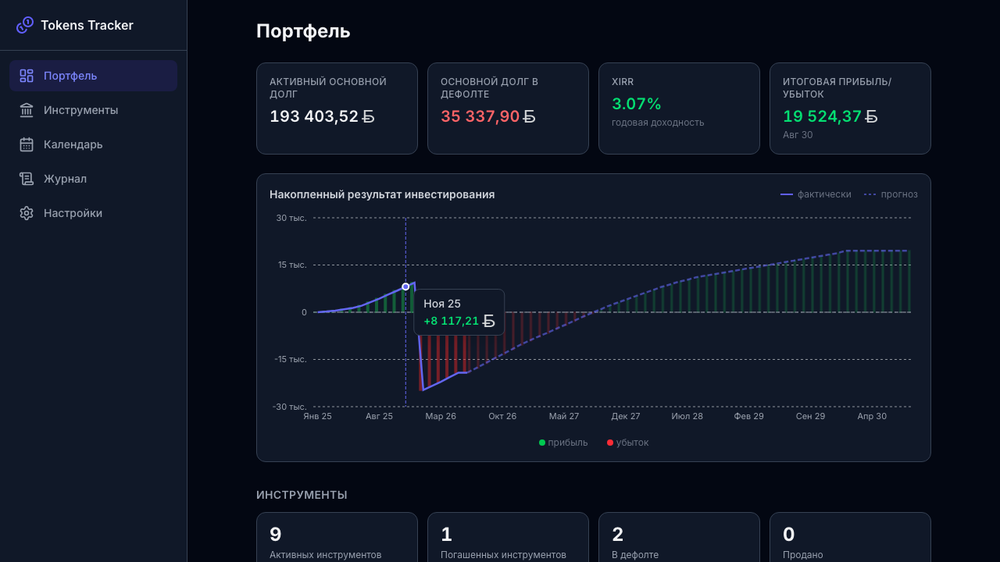

# Руководство по созданию скриншотов

В этом документе описано, как создать скриншоты приложения для документации.

## Подготовка

### 1. Запустить приложение

```bash
npm run dev
```

Приложение откроется на `https://localhost:5174/`

### 2. Включить режим презентации

1. Перейти в **Настройки** (Settings)
2. Прокрутить вниз до **Режим презентации** (Presentation Mode)
3. Включить переключатель
4. Приложение перезагрузится с демо-данными

## Скриншоты для документации

### Требования к скриншотам

- **Разрешение:** 1280×800 px (десктопная версия)
- **Браузер:** Chrome/Chromium
- **Тема:** Светлая (Light)
- **Язык:** Русский
- **Валюта:** USD

### Инструкция по созданию каждого скриншота

#### 1. Портфель (Portfolio) — `01-portfolio.png`

1. На главной странице (Portfolio)
2. Убедиться, что видны:
   - Все 6 метрик (Invested, Paid, Loss, P&L, XIRR, Remaining)
   - График портфеля (2 линии)
   - Список инструментов ниже
3. Сделать скриншот: `F12` → `Ctrl+Shift+P` → "Capture screenshot" или PrtScn

#### 2. Инструменты (Instruments) — `02-instruments.png`

1. Нажать на **Инструменты** в меню
2. Убедиться, что видна таблица с инструментами:
   - Название
   - Платформа
   - Статус (зеленый/синий/красный)
   - Купон
   - Даты
   - Кнопки действий
3. Сделать скриншот

#### 3. Детали инструмента — `03-instrument-detail.png`

1. Нажать на первый инструмент в таблице
2. Должны быть видны:
   - Основная информация (платформа, валюта, купон, даты)
   - Метрики (2×2 таблица)
   - Лоты покупки (Purchase Lots)
   - Раздел "Выплаты" с вкладками
3. Сделать скриншот

#### 4. Выплаты в инструменте — `04-payments.png`

1. На странице деталей инструмента прокрутить до раздела "Выплаты"
2. Убедиться, что видны:
   - Вкладка "Запланировано" (Upcoming)
   - Карточки выплат с:
     - Типом (купон/погашение)
     - Датой периода
     - Ожидаемой суммой
     - Кнопками действий
3. Сделать скриншот

#### 5. Календарь (Calendar) — `05-calendar.png`

1. Нажать на **Календарь** в меню
2. Убедиться, что видны:
   - Месяц и навигация (стрелки)
   - Вкладки "По инструментам" / "По типам"
   - Список выплат с инструментами и суммами
   - Статусы выплат (иконки ✓ ✗)
3. Сделать скриншот

#### 6. Журнал (Ledger) — `06-ledger.png`

1. Нажать на **Журнал** в меню
2. Убедиться, что видна таблица:
   - Дата
   - Инструмент
   - Тип операции (Покупка, Купон, Погашение)
   - Сумма (с плюсом/минусом)
   - Иконки операций
3. Сделать скриншот

#### 7. Настройки (Settings) — `07-settings.png`

1. Нажать на **Настройки** в меню
2. Убедиться, что видны:
   - Раздел "Общие" (Theme, Language, Base Currency)
   - Раздел "Курсы валют" с таблицей
   - Кнопка обновления курсов
3. Сделать скриншот

## Как сохранять скриншоты

### Способ 1: Встроенный скриншотер браузера

1. `F12` открыть DevTools
2. `Ctrl+Shift+P` открыть Command Palette
3. Написать "screenshot" и выбрать "Capture screenshot"
4. Файл загрузится в `Downloads`

### Способ 2: Системный скриншотер (macOS)

1. `Cmd+Shift+4` — выделение области
2. Отпустить мышку — скриншот сохранится на рабочий стол
3. Переместить в `docs/screenshots/`

### Способ 3: Системный скриншотер (Windows)

1. `Win+Shift+S` — выделение области
2. Скриншот скопируется в буфер обмена
3. Открыть Paint и вставить `Ctrl+V`
4. Сохранить как PNG в `docs/screenshots/`

## Сохранение файлов

Все скриншоты должны быть сохранены в:

```
docs/screenshots/
├── 01-portfolio.png
├── 02-instruments.png
├── 03-instrument-detail.png
├── 04-payments.png
├── 05-calendar.png
├── 06-ledger.png
└── 07-settings.png
```

## После создания скриншотов

1. Обновить [USER_GUIDE_RU.md](./USER_GUIDE_RU.md), добавив ссылки на скриншоты:

```markdown
## Портфель (Portfolio)



Главная страница приложения показывает сводку по всему портфелю...
```

2. Обновить [SCREENS_RU.md](./SCREENS_RU.md) аналогично

3. Закоммитить скриншоты:

```bash
git add docs/screenshots/
git commit -m "docs: add application screenshots for user guide"
```

## Советы по качеству

- 🎨 Убедитесь, что демо-данные видны полностью (нет скрытых элементов)
- 📐 Используйте одинаковое разрешение для всех скриншотов (1280×800)
- 🌐 Используйте русский язык и USD валюту для всех
- ✨ Выключите расширения браузера (они могут замещать UI)
- 🖼️ Используйте светлую тему для лучшей читаемости в документации

## Автоматизация (рекомендуется)

Есть готовый скрипт для автоматического создания всех скриншотов!

### Способ: Использование Playwright скрипта

1. **Запустить dev сервер в одном терминале:**

```bash
npm run dev
```

2. **В другом терминале запустить скрипт создания скриншотов:**

```bash
node create-screenshots.mjs
```

3. **Скрипт автоматически:**
   - Включит режим презентации
   - Создаст все 7 скриншотов
   - Сохранит их в `docs/screenshots/`

### Что делает скрипт

- ✅ Автоматически включает демо режим (Presentation Mode)
- ✅ Устанавливает правильный размер окна (1280×800)
- ✅ Отключает анимации для консистентных скриншотов
- ✅ Проходит по всем основным экранам
- ✅ Сохраняет скриншоты с правильными названиями
- ✅ Выводит прогресс и статус

## Ручное создание (альтернатива)

Если автоматизация не сработала, используйте инструкции выше для ручного создания скриншотов.
